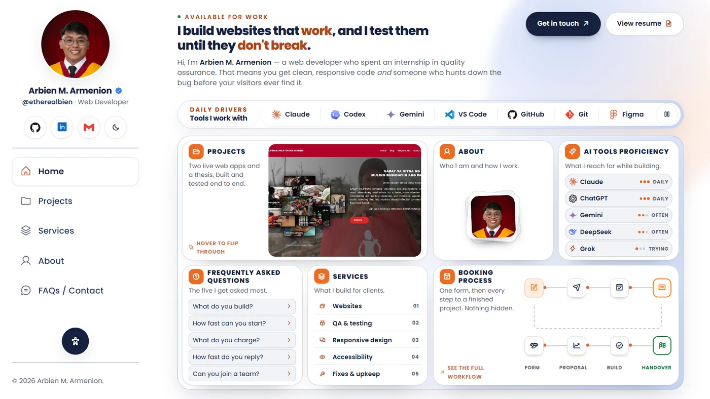
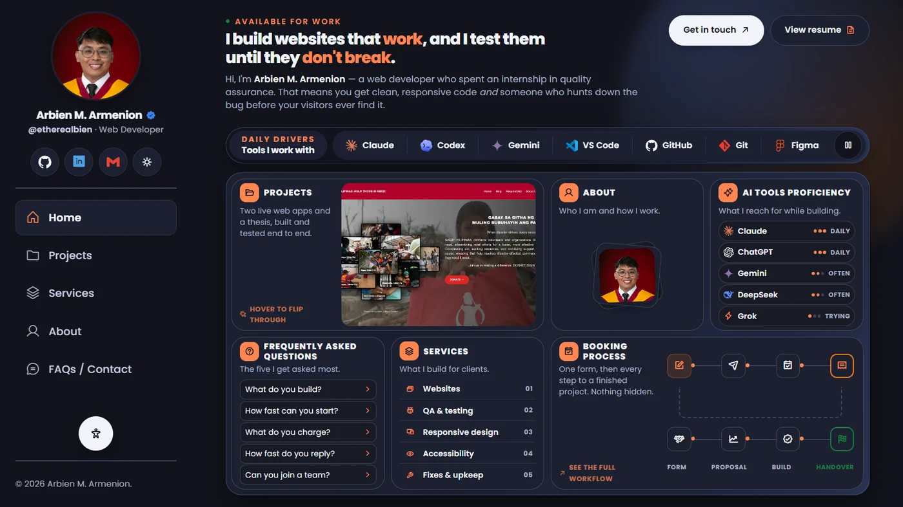

<h1 align="center">Arbien M. Armenion — Portfolio</h1>

<p align="center">
  <em>A web developer who thinks like a tester.</em>
</p>

<p align="center">
  <a href="https://armenion-portfolio.vercel.app"><strong>armenion-portfolio.vercel.app&nbsp;↗</strong></a>
</p>

<p align="center">
  
  
  
  
</p>

<p align="center">
  
  
</p>

---

## About this project

A portfolio for a Computer Engineering graduate moving into web development,
written by hand as a demonstration of the work itself. There is no framework, no
bundler and nothing to install — three files do the whole job, and the thing you
deploy is the thing you wrote.

It is built the way I would build a client site: semantic markup first, then a
design system in CSS custom properties, then the smallest amount of JavaScript
that makes it feel finished. The quality-assurance habit shows up in the parts
you cannot see — the fallbacks, the contrast maths, the measurements behind
every layout decision.

## What is worth looking at

| | |
| --- | --- |
| **One screen per view** | Home, Services and About are each sized to land inside the viewport without scrolling. The fit is derived, not hard-coded: root type scales with viewport height and spare space is distributed by the layout engine rather than predicted by a formula. |
| **Five views, one document** | Navigation swaps sections and pushes real URLs through the History API, so every view is linkable and the back button behaves. With JavaScript off the same markup degrades to one honest scrolling page. |
| **A live WebGL background** | A fragment shader draws a drifting contour field from 2D simplex noise over a faint grid. It paints straight alpha onto a transparent canvas, so a single shader serves both themes, and it stops itself on a hidden tab or when motion is reduced. |
| **Three themes, one source of truth** | Light, dark and high-contrast are the same custom properties with different values. Every pair was contrast-checked programmatically before it shipped. |
| **Reading options** | A floating panel scales the whole type system to 175%, turns on high contrast and reduces motion. Choices persist per browser. |
| **Built to be measured** | Layout was verified with headless-browser harnesses at ten viewport sizes rather than by eye — the fit table lives in the design notes. |

## Stack

| Layer | Choice | Why |
| --- | --- | --- |
| Markup | Semantic HTML5 | Every word is in the source, so crawlers index it instantly |
| Styling | CSS3 with custom properties | Theming, dark mode and text scaling with no preprocessor |
| Behaviour | Vanilla JavaScript | ~25 KB unminified, no runtime to download |
| Background | WebGL fragment shader | Ported from a React component; the shader is framework-agnostic |
| Font | Poppins (Google Fonts) | `preconnect` + `display=swap` |
| Icons | Phosphor Icons (CDN) | Icon font, loaded per style |

A framework would add a build pipeline and a hydration cost to a site that is
pure static content. Plain files load faster and deploy anywhere.

## Accessibility

- Base body text is 16px at a 1.65 line height; every colour pair meets WCAG AA,
  and high-contrast mode pushes past AAA.
- Full keyboard support: skip link, visible focus rings, ARIA landmarks, and
  interactive targets of at least 44px.
- Form inputs are never smaller than 16px, so iOS does not zoom on focus.
- `prefers-reduced-motion` and `prefers-color-scheme` are both respected, and the
  reading options can override either.

## SEO

Title and meta description, canonical URL, Open Graph and Twitter Card tags,
JSON-LD `Person` and `WebSite` structured data, one `h1` with a clean heading
hierarchy, descriptive link text, `robots.txt` and `sitemap.xml`.

## Structure

```
index.html          all page content and SEO metadata
css/style.css       design tokens, layout, components, responsive rules
js/script.js        theme, view switching, reveals, background field, reading options
assets/             profile photo, project shots, brand logos, previews
docs/               design and implementation notes
robots.txt          crawler rules
sitemap.xml         sitemap for search engines
```

## Run it locally

Any static server works. From the project folder:

```bash
python -m http.server 5173     # already on most machines
# or
npx serve .
```

Then open <http://localhost:5173>.

`python -m http.server` sends no `Cache-Control`, so a browser can keep serving
an old `style.css` after you edit it. The `?v=` stamps on the stylesheet and
script links in `index.html` exist for that — bump them when you change either
file. If a change still will not show, hard reload with <kbd>Ctrl</kbd> +
<kbd>Shift</kbd> + <kbd>R</kbd>.

## Design notes

The reasoning behind the layout — why the sidebar is built the way it is, how
the service cards stay aligned, what the booking diagram is doing, and the
measurements behind each decision — lives in
**[docs/DESIGN-NOTES.md](docs/DESIGN-NOTES.md)**.

## Credits

Brand marks are from [Simple Icons](https://simpleicons.org) (CC0) except where
a vendor does not publish one. Icons are [Phosphor](https://phosphoricons.com).
Type is [Poppins](https://fonts.google.com/specimen/Poppins).

## Contact

**Arbien M. Armenion** · Cebu City, Philippines
[armenionarbien53@gmail.com](mailto:armenionarbien53@gmail.com) ·
[GitHub](https://github.com/NE0FEL1S) ·
[LinkedIn](https://www.linkedin.com/in/arbien-armenion-782919369/)

---

<sub>Content and code © 2026 Arbien M. Armenion. Third-party marks belong to their owners.</sub>
